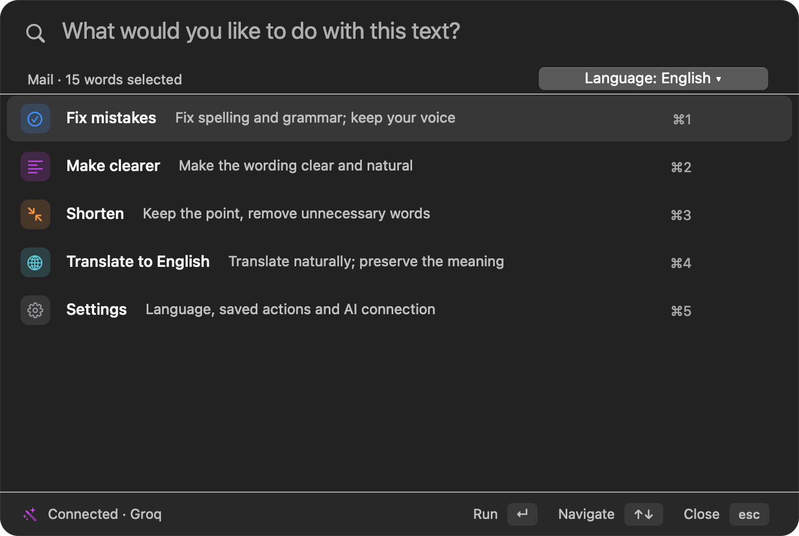
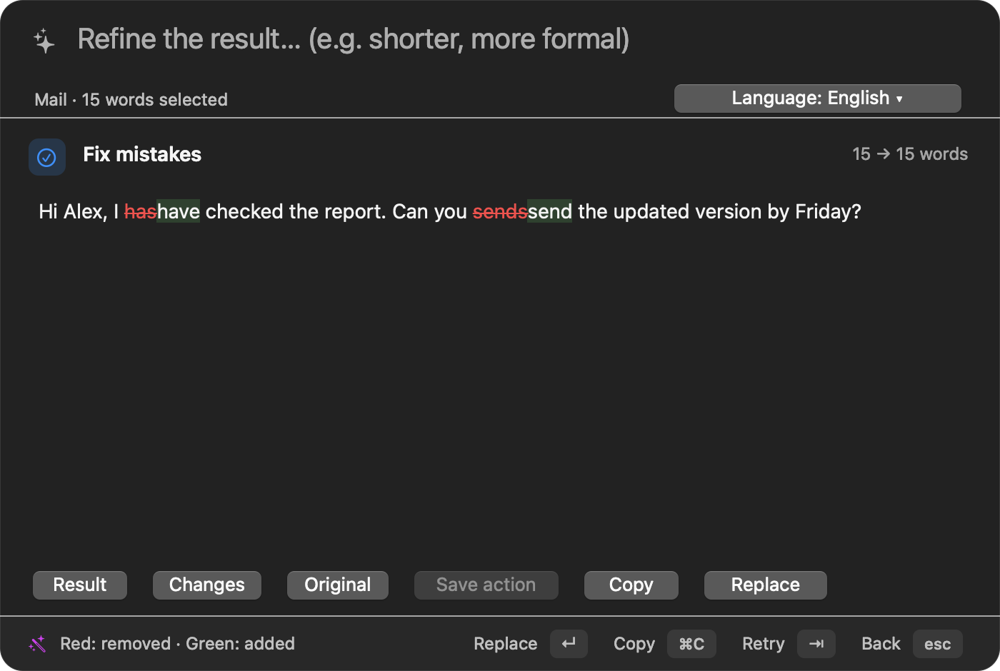

<div align="center">

# ActionFlow

### Better writing, right where you work.

Select text. Choose an action. Review the changes. Put it back.

**A small desktop writing assistant by WatashiGPT.**


[Quick start](#quick-start) · [How it works](#how-it-works) · [Privacy](#privacy) · [Advanced setup](docs/advanced.md)

</div>

<br>

<p align="center">
  
</p>

<p align="center"><sub>The macOS interface with example text. Linux follows the same workflow in a Tk window.</sub></p>

## Four actions. Your own instructions.

ActionFlow helps with the writing you already do: messages, emails and everyday notes.
Use it from the app you are working in, without moving your text into a separate chat.

| Action | When to use it |
| :--- | :--- |
| **Fix mistakes** | Correct spelling, grammar and punctuation while keeping your voice. |
| **Make clearer** | Make a sentence easier to understand, without making it more formal. |
| **Shorten** | Remove unnecessary words and keep the essential information. |
| **Translate** | Translate directly into your last chosen language. |

Need something different? Type an instruction:

> Make this friendlier, but keep it short.
>
> Turn these notes into an email.
>
> Translate into English using simple, natural wording.

After a successful custom instruction, choose **Save action** to use it again on different text.
Only the instruction and its name are saved. You can remove saved actions in Settings.

## How it works

1. **Select** text in your editor, browser, mail app or messenger.
2. **Open** ActionFlow with **⌃⌥X** on macOS or **Ctrl+Alt+X** on Linux.
3. **Choose** one of the four actions, or write your own instruction.
4. **Review** the streamed result. Compare **Original**, **Changes** and **Result**.
5. **Replace** the selection, **Copy** the result, or type a refinement and try again.

<p align="center">
  
</p>

<p align="center"><sub>Review exactly what changed. Copy and Replace always use the clean result, even when Original or Changes is selected.</sub></p>

The language selector remembers your translation language. The last accepted or copied action
is remembered too. There is no YAML to edit for ordinary use.

## Quick start

### macOS

```sh
git clone https://github.com/azimxxd/watashigpt.git
cd watashigpt
# This writing-focused version is currently on the macos-support branch.
git switch macos-support
cd action-middleware
./run.sh
```

The launcher creates a virtual environment and installs dependencies on the first run.
Use Python **3.9+**, or an installed `uv` to let the launcher provision Python 3.12.

- Grant your terminal **Accessibility** and **Input Monitoring** in
  **System Settings → Privacy & Security**. Restart the terminal if prompted.
- Connect an AI provider in the first-run practice window. Enter an API key and choose a model
  available to your account, or connect a local model.
- Try the sample sentence. The practice window never replaces text in another app.

Return to setup through **Settings & practice…** in the menu bar. Existing provider configuration
is retained. Start-at-login instructions are in [advanced setup](docs/advanced.md#start-at-login).

<details>
<summary><strong>Linux setup</strong></summary>

Install the tools for your desktop session:

```sh
# Wayland
sudo apt-get install python3-tk wl-clipboard libnotify-bin python3-gi gir1.2-atspi-2.0

# X11
sudo apt-get install python3-tk xclip xdotool libnotify-bin
```

Then clone the repository, select `macos-support`, and run `action-middleware/run.sh` as above.
The Tk window provides the same four actions, custom instructions, streaming preview and saved actions.

Global hotkeys currently require root, so the launcher uses `sudo -E`.
A working desktop keyring is needed to save API keys through the UI. For sessions without one,
use the environment-based configuration described in [advanced setup](docs/advanced.md#providers).

Automatic replacement requires a verifiable source window. On unsupported desktop/compositor
combinations, use **Copy** and paste the result yourself.

</details>

## Review stays in your hands

| Control | Action |
| :--- | :--- |
| **Enter** | Replace the selection, or apply a typed refinement. |
| **Tab** | Regenerate after the request finishes. |
| **Escape** | Cancel generation or go back. |
| **Original / Changes / Result** | Switch the preview without changing the output. |
| **Save action** | Save a standalone custom instruction for reuse. |
| **Language** | Change the default translation language. |

Before replacing, ActionFlow checks the source app/window, selected text and clipboard. If the
selection changes, the generated result stays available in a copyable popup. The delayed clipboard
restore skips newer copies; on macOS it also preserves the previous clipboard's rich formats.

**To undo:** select the exact last inserted result in its source app, then press **⌃⌥Z** or
**Ctrl+Alt+Z**. Undo does not paste the original text at an unchecked cursor position.

**Current limitation:** generated edits are plain text. Prompts request that paragraph/list structure,
facts, names, numbers and links be preserved, but the model can still make mistakes. Review the result;
fonts, colours and other rich-text styles are not retained.

## A small interface, with room to grow

The main palette stays focused. Enable either optional group in **Settings** if you need it:

- **Additional tools:** summarize, change tone, count words, format structured text, redact data
  and other text utilities.
- **Developer tools:** code review, docstrings, regular expressions and commit messages.

Both groups are off by default. Saved instructions are the simplest way to add your own recurring tasks.
Contextual refinements cannot be saved as standalone actions, because they depend on an earlier result.

<details>
<summary><strong>Upgrading from the command-heavy version?</strong></summary>

Shell execution, image generation, Wikipedia and dictionary commands are retired, including their old
prefixes. Novelty commands no longer appear in the palette.

Existing non-retired prefixes, chains and personal commands remain available. Prefix commands run
immediately rather than opening a preview. See [legacy commands](docs/advanced.md#legacy-commands)
for compatibility details.

</details>

## Privacy

- **Your provider:** AI actions send selected text to the configured provider, and to a configured
  backup if needed. With local-only providers, generation stays on your machine.
- **Your keys:** GUI setup verifies the connection before saving the key in the system keyring.
  Existing environment/config key overrides still work.
- **Your text:** history and diagnostic logs hide text by default. Sensitive command output remains
  masked even when text logging is enabled.
- **Your preferences:** language and saved instructions live in `~/.actionflow_preferences.json`,
  written atomically with mode `600`. Saving an action does not save the selected text or its result.
- **Optional local counts:** disabled by default. If enabled, they store fixed aggregate counters for
  generation, acceptance, copying, discarding and failures. No text, instructions, app names or timestamps
  are included in the counters. They are never uploaded, and practice sessions are excluded.

## Development

```sh
cd action-middleware
.venv/bin/python -m pip install -r requirements-dev.txt
.venv/bin/python -m pytest tests
.venv/bin/python -m pyflakes main.py actionflow/*.py tests/*.py
```

If your virtual environment was created with `uv` and has no pip, install development dependencies with
`uv pip install --python .venv/bin/python -r requirements-dev.txt`.

| Module | Responsibility |
| :--- | :--- |
| `product.py` | Four writing actions, optional groups and word-level diffs. |
| `palette.py` | Shared product logic for the macOS and Linux interfaces. |
| `mac_ui.py` / `tk_ui.py` | Native AppKit and Tk windows. |
| `preferences.py` | Local settings, saved instructions and opt-in counters. |
| `connection.py` / `llm.py` | Connection setup, provider requests, streaming and fallback. |
| `main.py` | Selection capture, dispatch, safe replacement and undo. |

Tests cover routing, privacy, command restrictions, preferences, provider setup and preview safety.
Native AppKit checks run when available. For desktop integration, use the
[manual smoke checklist](docs/advanced.md#manual-smoke-checks).

---

Want to check whether this actually helps people write? Start with the
[one-week pilot guide](docs/pilot.md) for 5–10 participants. It focuses on repeat use and friction,
without collecting their private writing.
